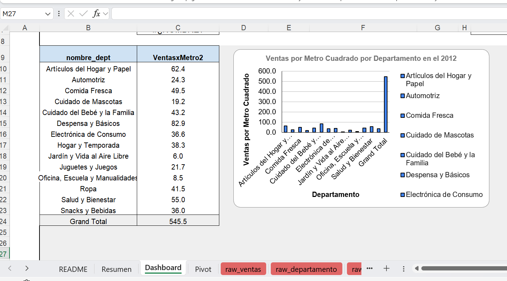
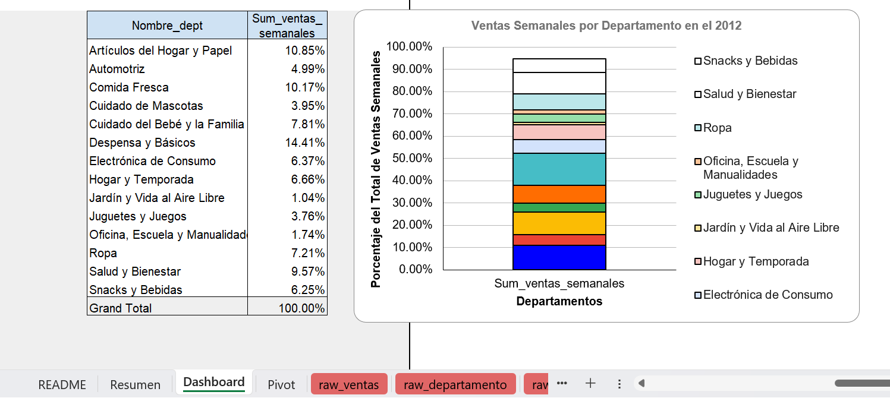

# Proyecto: Resumen Ejecutivo de Ventas Walmart Bootcamp Data Analyst – TripleTen (2026)

## Objetivo
Analizar las ventas utilizando un archivo de Excel para identificar tendencias, KPIs y oportunidades de mejora.

## Archivo utilizado
- Proyecto _ Resumen Ejecutivo de Ventas Walmart.xlsx
- Proyecto _ Resumen Ejecutivo de Ventas Walmart.csv

## Dashboard

## Actividades realizadas
- Limpieza y formato de datos
- Tablas dinámicas
- Creación de KPIs
- Dashboard en Excel
- Elaboración de Graficos
- Resumen Ejecutivo

## Herramientas
- Excel Dashboards KPIs Tablas Dinámicas
- GitHub

## Resultados
- Incremento en claridad de métricas
- Dashboard con indicadores de ventas
- Graficos de las ventas
